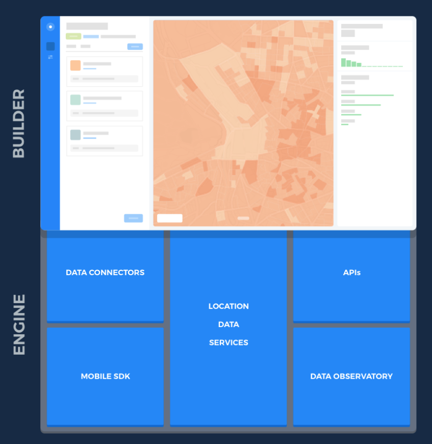
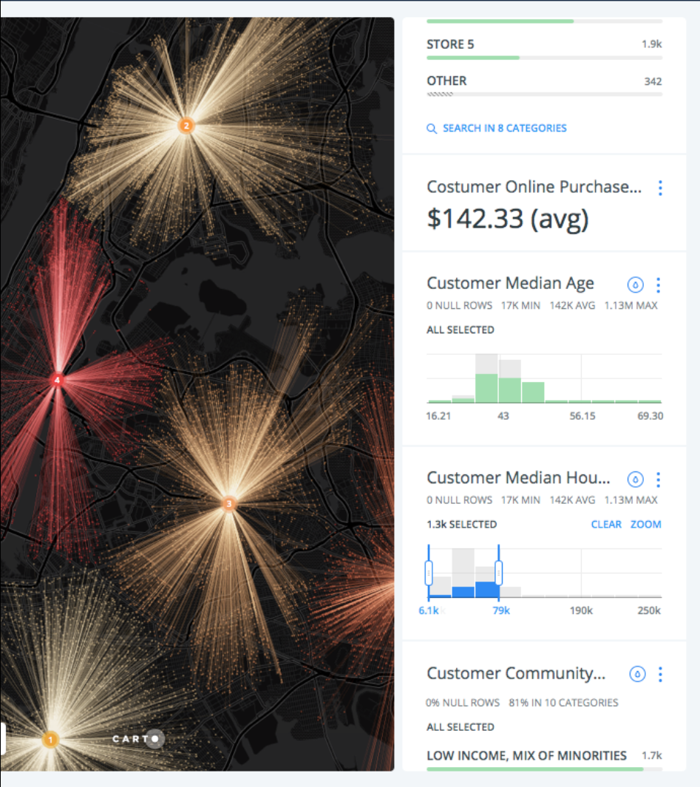
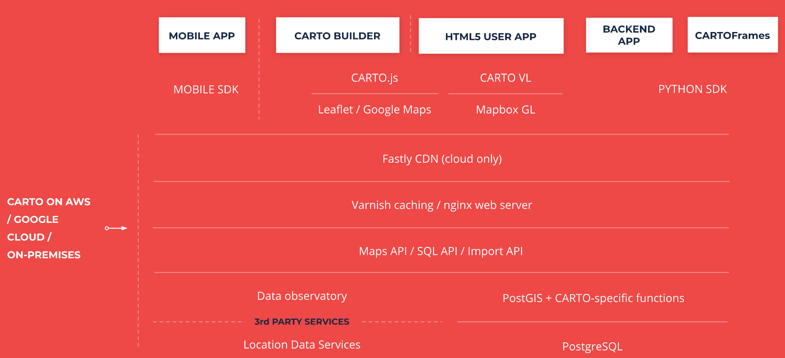
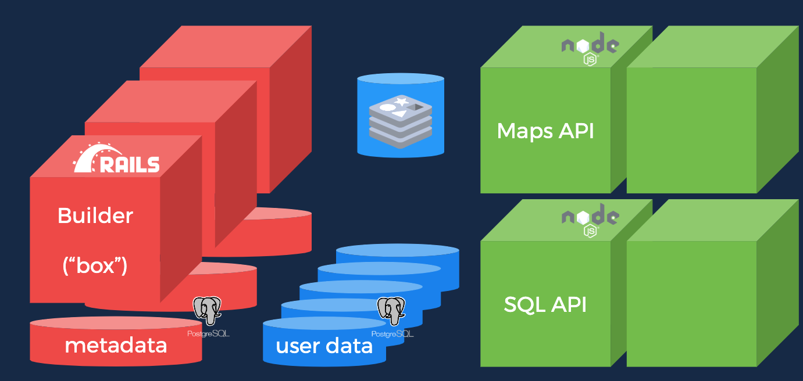

.. _estado-del-arte:

Estado del arte
===============

En este capítulo se presenta un informe sobre los diferentes sistemas de almacenamiento y procesamiento Big Data para los que se va a dar soporte para la realización de conectores para CARTO y una breve definición de los conceptos teóricos que sirven de fundamentación para el trabajo.

CARTO
-----

*CARTO* [#f1]_ es una plataforma de :ref:`location-intelligence` que permite transformar datos geoespaciales en resultados de negocio.

A diferencia del :ref:`business-intelligence`, *Location Intelligence* es el conjunto de herramientas y metodologías que permiten extraer conocimiento y tomar decisiones de negocio a partir de datos geoespaciales.

*CARTO* es una plataforma :ref:`saas` referente en este sector que permite de una manera sencilla e intuitiva la importación de conjuntos de datos con información geoespacial para crear a través de :ref:`dashboard` y *widgets*, mapas con capacidades de análisis, filtrado, búsqueda y predicción de variables.

La plataforma, da soporte a todo el flujo de trabajo para el análisis de datos geoespaciales. Desde la ingestión de datos, enriquecimiento con nuevas fuentes de datos, análisis, visualización e integración.

*CARTO* cuenta con la posibilidad de importar datos desde diversas fuentes de datos, pero carece de soporte nativo para conectar a algunos de los principales sistemas de almacenamiento Big Data usados generalmente para almacenar datos operacionales o secuencias de datos temporales.

Actualmente, *CARTO* cuenta con más de 300000 usuarios registrados y es usado por más de 2000 organizaciones de todo el mundo para tomar decisiones a partir de sus datos geolocalizados.

Productos
^^^^^^^^^

En la actualidad, CARTO es una plataforma formada por multitud de APIs, librerías, soluciones y verticales. Para el objetivo de este trabajo nos vamos a centrar en  5 productos principales.

- BUILDER [#f2]_

Una herramienta web de análisis para que analistas y usuarios de negocio que permite crear cuadros de mando accionables que se pueden compartir.

- ENGINE [#f3]_

Un conjunto de herramientas geoespaciales, servicios y APIs para el desarrollo de aplicaciones geoespaciales.

- Location Data Services [#f4]_

Mapas base, mapas vectoriales, servicios de geocodificación y cálculo de rutas que se pueden consumir fácilmente en BUILDER o integrar a través de ENGINE.

- Data Observatory [#f5]_

Servicios para enriquecimiento de datos, a través de fronteras, datos demográficos y otros conjuntos de datos para dar valor a los propios datos de los usuarios.

- Data connectors [#f5b]_

APIs para ingestión de datos en la plataforma

Arquitectura
^^^^^^^^^^^^

El siguiente diagrama muestra la arquitectura de componentes simplificada de *CARTO*.

Para el objetivo de este trabajo final de máster, vamos a obviar los casos de aplicaciones móviles o HTML5 y vamos a centrarnos en *BUILDER*.

*BUILDER* está formado por un conjunto de tecnologías de :ref:`backend`, que están desplegadas en la nube de Amazon, Google o Azure (u :ref:`on-premise`) y un conjunto de tecnologías de :ref:`frontend` que se corresponden con librerías JavaScript que se ejecutan en el navegador.

Dentro de las tecnologías :ref:`backend` encontramos las siguientes:

- PostgreSQL y PostGIS

PostgreSQL [#f6]_ es una base de datos relacional con soporte a SQL estándar distribuida con licencia libre y código abierto. PostGIS [#f7]_ es una extensión para PostgreSQL que añade soporte geoespacial a través de estructuras de datos (tipos, índices, etc.) y funciones.

*CARTO* utiliza PostgreSQL y PostGIS para almacenamiento de la información geoespacial generada por los usuarios y para realizar los análisis geoespaciales que permiten construir cuadros de mandos, visualizar mapas, etc.

El acceso a PostgreSQL y PostGIS está abierto a los usuarios a través del uso de las :ref:`API` de la plataforma.

Las version actuales de PostgreSQL y PostGIS utilizados por CARTO son la 10.0 y 2.4 respectivamente.

- APIs de la plataforma (maps, SQL, import, analysis, etc.)

Las APIs de la plataforma son parte de las APIs ofrecidas por *ENGINE* y utilizadas a su vez por *BUILDER* y por aplicaciones móviles o HTML5 creadas por terceros.

*CARTO* ofrece un conjunto amplio de APIs :ref:`REST`, JavaScript y :ref:`SDK` de desarrollo en diferentes lenguajes. A continuación se describen las más relevantes para el trabajo:

  - maps API: Permite obtener teselas de los datos almacenados en PostgreSQL
  - SQL API: Permite realizar consultas SQL contra PostgreSQL y PostGIS y utilizar todas las funciones disponibles incluidas las de *Location Data Services* y *Data Obervatory*
  - import API: Permite importar datos en formato geoespacial

- Varnish

Varnish [#f8]_ es un acelerador de aplicaciones web, también conocido como servidor proxy de caché HTTP. Permite cachear peticiones HTTP y su contenido.

- Nginx

Nginx [#f9]_ es un servidor web HTTP.

- CDN

Una Content Delivery Network (CDN o, en español, una “Red de distribución de contenido”) es un conjunto de servidores que contienen copias de una misma serie de contenidos (imágenes, vídeos, documentos, …) y que están ubicados en puntos diversos de una red para poder servir sus contenidos de manera más eficiente. [#f10]_

- BUILDER

*BUILDER* es una aplicación escrita en Ruby on Rails y JavaScript, que a través de las APIs de la plataforma permite a los usuarios finales:

  - Gestionar sus datos geoespaciales
  - Gestionar sus mapas
  - Definir orígenes de datos con filtros y consultas SQL
  - Definir simbología a través de CartoCSS [#f11]_
  - Publicar mapas y embeberlos

Todo esto, centrado en la experiencia de usuario a través de una interfaz de usuario atractiva y fácil de usar.

Tecnologías backend
^^^^^^^^^^^^^^^^^^^

En lo que se refiere a tecnologías backend, el siguiente diagrama muestra un resumen de frameworks a más bajo nivel dentro de *BUILDER*.

Nos encontramos principalmente con dos frameworks de desarrollo: Por una parte, Rails [#f11b]_ que se utiliza para dos soporte a servicios y APIs para la gestión de datos, tablas, mapas, visualizaciones. Y por otra parte NodeJS [#f11c]_ que da soporte a APIs de alta carga de peticiones (varios cientos de millones de peticiones mensuales), para procesar, analizar y visualizar información geoespacial.

Por último, como hemos visto antes tanto la información de usuario, se almacena en PostgreSQL y PostGIS para dar soporte geoespacial.

Sistemas de almacenamiento y procesamiento Big Data
---------------------------------------------------

En este trabajo se estudian los siguientes sistemas de almacenamiento y procesamiento Big Data, ya que son los sistemas más utilizadas por las actuales organizaciones que usan *CARTO* como plataforma de *Location Intelligence*:

- Apache Hive [#f12]_
- Apache Impala [#f13]_
- Amazon Redshift [#f14]_
- MongoDB [#f15]_
- Google BigQuery [#f16]_

En esta sección se va a hacer una breve descripción de los sistemas mencionados atendiendo a las siguientes características:

- Tipo de sistema: Si ofrece almacenamiento y procesamiento o sólo uno de ambos.
- Tipo de procesamiento: Batch (latencia del orden de minutos), interactivo (latencia del orden de decenas de segundos), tiempo real (latencia del orden de pocos segundos), etc.
- Tipo de despliegue/distribución: Nube pública, privada, SaaS, on-premises, etc.
- Interfaces de programación/consulta: SQL, SDKs en diferentes lenguajes, APIs REST, etc.
- Autenticación: Usuario y contraseña, HTTP/HTTPS, Kerberos/LDAP, OAuth, etc.
- Tipo de licencia/propietario: Software libre (Apache, GPL, etc.), propietaria (Google, Amazon, Oracle, etc.)
- Versión actual
- Driver ODBC

Para el motivo de este trabajo, no es necesario conocer otros detalles como mecanismos de replicación, particionamiento, tolerancia a fallos, etc. ya que el objetivo no consiste en administrar este tipo de sistemas.

Sin embargo, el objetivo es triple:

1. Por una parte, contar con una visión general de los sistemas con los que se va a trabajar.
2. Por otra parte, poder identificar similitudes y diferencias entre ellos.
3. Por último, abrir la puerta al soporte del mayor número posible de tecnologías de almacenamiento y procesamiento Big Data, especialmente aquellas de carácter libre.

Apache Hive
^^^^^^^^^^^

Apache Hive es una infraestructura de almacenamiento y procesamiento de datos almacenados sobre :ref:`HDFS` de Hadoop [#f17]_ y otros sistemas compatibles como Amazon S3 [#f18]_, originalmente desarrollado por Facebook [#f19]_.

Ofrece un lenguaje de consulta basado en SQL llamado *HiveQL* que convierte las consultas en trabajos MapReduce, Tez [#f20]_ o Spark [#f21]_.

Actualmente, como gran parte de los sistemas batch es considerado un sistema *legacy*, aunque por otra parte es un sistema apliamente establecido en la industria que cuenta con gran cantidad de herramientas integradoras dentro del sistema Hadoop tales como: Pig [#f22]_, Sqoop [#f23]_, Flume [#f24]_, etc.

Se suele utilizar para procesamiento batch de ficheros almacenados en HDFS.

- Tipo de sistema: Procesamiento.
- Tipo de procesamiento: Batch.
- Tipo de despliegue/distribución: Nube pública y privada (on-premises) con multitud de distribuciones (Amazon EMR [#f25]_, Cloudera [#f26]_, Hortonworks [#f27]_, MapR [#f28]_)
- Interfaces de programación/consulta: HiveQL compatible con SQL
- Autenticación: Usuario y contraseña, HTTP/HTTPS, Kerberos/LDAP
- Tipo de licencia/propietario: Apache 2.0
- Versión actual: 2.3.0
- Driver ODBC: sí

Impala
^^^^^^

Apache Impala es una infraestructura de almacenamiento y procesamiento de datos almacenados sobre HDFS de Hadoop, originalmente desarrollado por Cloudera.

Apache Impala es compatible con HiveQL y utiliza la misma base de datos de metadatos para acceder a HDFS que Hive, pero a diferencia de este, cuenta con un modelo de procesamiento en memoria de baja latencia que permite realizar consultas interactivas orientadas a entornos *Business Intelligence*.

Se suele utilizar para procesamiento de ficheros almacenados HDFS con menor latencia que Hive y por tanto orientada a aplicaciones finales.

- Tipo de sistema: Procesamiento.
- Tipo de procesamiento: Interactivo.
- Tipo de despliegue/distribución: Nube pública y privada (on-premises) con multitud de distribuciones.
- Interfaces de programación/consulta: HiveQL compatible con SQL
- Autenticación: Usuario contraseña, Kerberos, otros
- Tipo de licencia/propietario: Apache 2.0
- Versión actual: 2.10.0
- Driver ODBC: sí

Amazon Redshift
^^^^^^^^^^^^^^^

Amazon Redshift es un almacén de datos rápido y completamente administrado que permite analizar todos los datos empleando de forma sencilla y rentable SQL estándar y las herramientas de Business Intelligence existentes.

Forma parte de la familia de servicios web de Amazon (AWS), por tanto se integra con gran parte de sus servicios, como por ejemplo Amazon S3.

Se suele utilizar para almacenar y analizar datos en entornos donde es necesaria una alta integración con otros servicios de AWS.

- Tipo de sistema: Almacenamiento y procesamiento.
- Tipo de procesamiento: Interactivo.
- Tipo de despliegue/distribución: Nube pública (Amazon Web Services)
- Interfaces de programación/consulta: SQL
- Autenticación: Usuario y contraseña.
- Tipo de licencia/propietario: Propietario.
- Versión actual: Al ser un servicio auto-administrado por Amazon no se ofrece información de versiones
- Driver ODBC: Sí

MongoDB
^^^^^^^

MongoDB es una base de datos orientada a objetos que pertenece a la familia de bases de datos :ref:`nosql`. Está diseñada para soportar escalabilidad, particionamiento, replicación, alta disponibilidad siendo de las primeras bases de datos NoSQL en ofrecer estas características y una de las más populares en la actualidad.

Se suele utilizar como base de datos operacional y es muy popular en arquitecturas :ref:`mean`, en las que tanto el front como el backend están desarrollados sobre Javascript.

- Tipo de sistema: Almacenamiento y procesamiento.
- Tipo de procesamiento: Interactivo.
- Tipo de despliegue/distribución: on-premises
- Interfaces de programación/consulta: Javascript (nativo) y otros SDK con lenguajes varios.
- Autenticación: Usuario y contraseña, Kerberos/LDAP
- Tipo de licencia/propietario: AGPL v3.0
- Versión actual: 3.4
- Driver ODBC: Sí

Google BigQuery
^^^^^^^^^^^^^^^

Google BigQuery es el almacén de datos en la nube de Google, totalmente administrado y apto para analizar petabytes de datos.

Google BigQuery es un sistema de almacenamiento con una arquitectura :ref:`serverless` y ofrecido a modo de SaaS. Entre sus características principales destaca la integración con otros servicios de Google como Google Cloud Storage [#f29]_, el soporte de OAuth [#f30]_ y acceso a través de API REST o SDKs en diferentes lenguajes.

Se suele utilizar en entornos donde se requiere integración con otros servicios de Google y en los que se pretende evitar el coste de mantenimiento de infraestructura.

- Tipo de sistema: Almacenamiento y procesamiento.
- Tipo de procesamiento: Interactivo.
- Tipo de despliegue/distribución: SaaS
- Interfaces de programación/consulta: API REST, SDKs
- Autenticación: OAuth
- Versión actual: Al ser un servicio auto-administrado por Google no se ofrece información de versiones
- Tipo de licencia/propietario: Propietario (Google)
- Driver ODBC: Sí

Tabla resumen
-------------

+----------------+---------------+---------------+-----------------+------------------+-----------------+
| Característica | Apache Hive   | Apache Impala | Amazon Redshift | MongoDB          | Google BigQuery |
+================+===============+===============+=================+==================+=================+
| Tipo           | Procesamiento | Procesamiento | Almacenamiento  | Almacenamiento   | Almacenamiento  |
| de sistema     |               |               | Procesamiento   | Procesamiento    | Procesmiento    |
+----------------+---------------+---------------+-----------------+------------------+-----------------+
| Tipo de        | Batch         | Interactivo   | Interactivo     | Interactivo      | Interactivo     |
| procesamiento  |               |               |                 |                  |                 |
+----------------+---------------+---------------+-----------------+------------------+-----------------+
| Tipo de        | Nube          | Nube          | SaaS            | Nube             | SaaS            |
| despliegue     | on-premises   | on-premises   |                 | on-premises      |                 |
+----------------+---------------+---------------+-----------------+------------------+-----------------+
| Interfaces     | SQL           | SQL           | SQL             | SDKs, Javascript | API REST, SDKs  |
+----------------+---------------+---------------+-----------------+------------------+-----------------+
| Autenticación  | Usuario       | Usuario       | Usuario         | Usuario          | OAuth 2.0       |
+----------------+---------------+---------------+-----------------+------------------+-----------------+
| Versión        | 2.3.0         | 2.10.0        | -               | 3.4              | -               |
| actual         |               |               |                 |                  |                 |
+----------------+---------------+---------------+-----------------+------------------+-----------------+
| Licencia       | Libre         | Libre         | Propietario     | Libre            | Propietario     |
+----------------+---------------+---------------+-----------------+------------------+-----------------+
| Driver ODBC    | Sí            | Sí            | Sí              | Sí               | Sí              |
+----------------+---------------+---------------+-----------------+------------------+-----------------+

.. [#f1] https://carto.com/ - mayo 2019
.. [#f2] https://carto.com/builder/ - mayo 2019
.. [#f3] https://carto.com/engine/ - mayo 2019
.. [#f4] https://carto.com/location-data-services/ - mayo 2019
.. [#f5] https://carto.com/data-observatory/ - mayo 2019
.. [#f5b] https://carto.com/integrations/ - mayo 2019
.. [#f6] https://www.postgresql.org/ - mayo 2019
.. [#f7] http://postgis.net/ - mayo 2019
.. [#f8] https://varnish-cache.org/ - mayo 2019
.. [#f9] https://nginx.org/ - mayo 2019
.. [#f10] https://manueldelgado.com/que-es-una-content-delivery-network-cdn/ - mayo 2019
.. [#f11] https://carto.com/docs/carto-engine/cartocss/ - mayo 2019
.. [#f11b] https://rubyonrails.org/ - mayo 2019
.. [#f11c] https://nodejs.org/es/ - mayo 2019
.. [#f12] https://hive.apache.org/ - mayo 2019
.. [#f13] https://impala.apache.org/ - mayo 2019
.. [#f14] https://aws.amazon.com/es/redshift/ - mayo 2019
.. [#f15] https://www.mongodb.com/ - mayo 2019
.. [#f16] https://cloud.google.com/bigquery/ - mayo 2019
.. [#f17] http://hadoop.apache.org/ - mayo 2019
.. [#f18] https://aws.amazon.com/es/s3/ - mayo 2019
.. [#f19] https://facebook.com/ - mayo 2019
.. [#f20] https://tez.apache.org/ - mayo 2019
.. [#f21] https://spark.apache.org/ - mayo 2019
.. [#f22] https://pig.apache.org/ - mayo 2019
.. [#f23] https://sqoop.apache.org/ - mayo 2019
.. [#f24] https://flume.apache.org/ - mayo 2019
.. [#f25] https://aws.amazon.com/es/emr/ - mayo 2019
.. [#f26] https://www.cloudera.com - mayo 2019
.. [#f27] https://es.hortonworks.com/ - mayo 2019
.. [#f28] https://mapr.com/ - mayo 2019
.. [#f29] https://cloud.google.com/storage/ - mayo 2019
.. [#f30] https://oauth.net/ - mayo 2019
