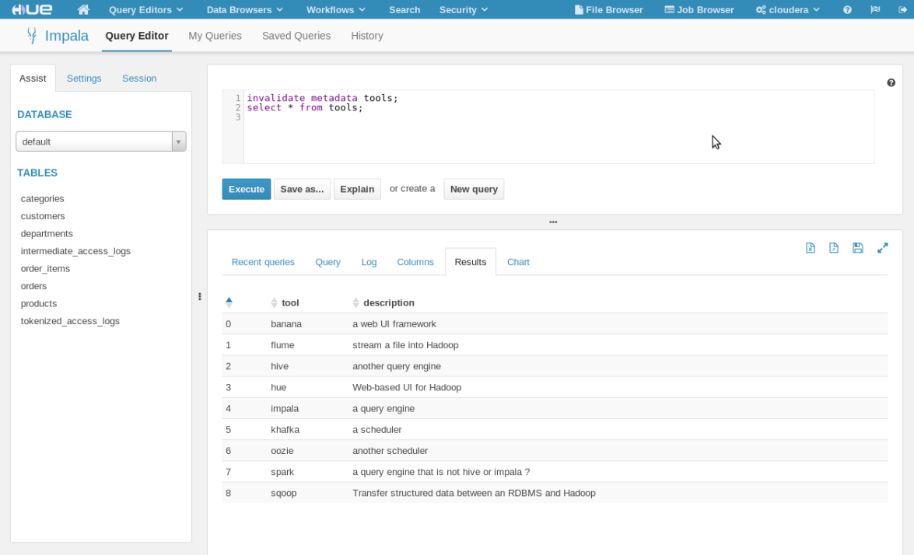
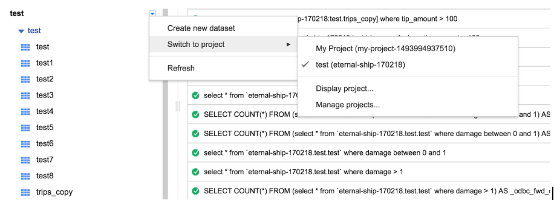
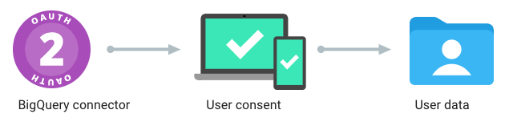
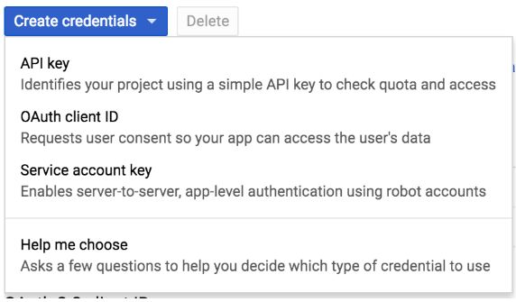
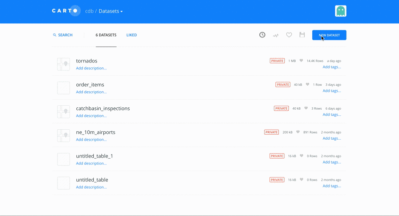

.. _desarrollo:

Desarrollo del trabajo y resultados obtenidos
=============================================

De acuerdo a la metodología definida en el apartado a interior, en este apartado se incluye el desarrollo de la misma para cada uno de los sistemas de almacenamiento Big Data objetivo de ser integrados con CARTO.

El objetivo es contar con un procedimiento sistemático que incluya al menos las siguientes fases, para cada sistema de almacenamiento:

1. Despliegue de un entorno de prueba del sistema de almacenamiento Big Data
2. Búsqueda, instalación y prueba de un driver ODBC compatible
3. Búsqueda, instalación y prueba de un Foreign Data Wrapper (opcionalmente se puede utilizar la implementación base de PostgreSQL o implementar una propia)
4. Desarrollo de un conector para CARTO
5. Ingestión de datos hacia CARTO

Integración de CARTO con Apache Hive
------------------------------------

Apache Hive es una infraestructura de almacenamiento y procesamiento de datos almacenados sobre HDFS de Hadoop y otros sistemas compatibles como Amazon S3, originalmente desarrollado por Facebook.

Hive es fundamentalmente una capa de abstracción que convierte consultas SQL (escritas en un lenguaje compatible con SQL llamado HiveQL) en trabajos MapReduce, Tez o Spark.

La integración de CARTO con Apache Hive se va a realizar de acuerdo a los siguientes parámetros:

- Soporta SQL: Sí
- Driver ODBC: Sí
- Compatible con `postgres_fdw`: Sí
- Versión probada: 2.3.0
- Autenticación: Usuario y contraseña
- Distribución: Cloudera Quickstart
- Despliegue: Docker sobre AWS

.. _hive_env:

Despliegue de un entorno de prueba de Apache Hive
^^^^^^^^^^^^^^^^^^^^^^^^^^^^^^^^^^^^^^^^^^^^^^^^^

Para desplegar una instancia de Apache Hive, utilizamos la imagen de Cloudera Quickstart disponible en Docker Hub, ejecutando el siguiente comando:

::

    docker pull cloudera/quickstart:latest
    docker run --name=cloudera -p 8888:8888 -p 10000:10000 -p 21050:21050 -v /tmp:/tmp --hostname=quickstart.cloudera --privileged=true -t -i -d cloudera/quickstart /usr/bin/docker-quickstart
    docker exec -it cloudera /bin/bash

Para este caso, hay que tener en cuenta que la imagen de Cloudera Quickstart cuenta con una distribución completa de Hadoop, por tanto con la imagen se arrancan multitud de servicios y es necesaria una cantidad considerable de memoria RAM.

Para el caso en el que sea desea correr esta imagen en una máquina local o con recursos limitados, es posible que algunos de los procesos no arranquen. En estos casos, es recomendable parar el resto de procesos que no son imprescindibles para contar con una instancia de Apache Hive.

Deteniendo los siguientes servicios es posible arrancar una imagen de Cloudera Quickstart con Docker, únicamente con 2GB de memoria:

::

    /etc/init.d/flume-ng-agent stop
    /etc/init.d/oozie stop
    /etc/init.d/spark-history-server stop
    /etc/init.d/solr-server stop
    /etc/init.d/flume-ng-agent stop
    /etc/init.d/hive-metastore restart
    /etc/init.d/hive-server2 restart
    /etc/init.d/flume-ng-agent stop
    /etc/init.d/hbase-master stop
    /etc/init.d/hbase-regionserver stop
    /etc/init.d/hbase-rest stop
    /etc/init.d/hbase-solr-indexer stop
    /etc/init.d/hbase-thrift stop
    /etc/init.d/oozie stop
    /etc/init.d/sentry-store stop

Después de detener los servicios es importante reiniciar la interfaz de HUE que nos permitirá realizar consultas interactivas sobre Hive con el siguiente comando: `/etc/init.d/hue restart`

.. _hive_ing:

Ingestión de datos en Apache Hive
^^^^^^^^^^^^^^^^^^^^^^^^^^^^^^^^^

Una vez hemos desplegado Apache Hive utilizando la imagen de Cloudera Quickstart con Docker, podemos hacer una ingestión inicial de datos para posteriormente realizar las pruebas necesarias de integración con CARTO.

Abriendo una sesión de bash en el contenedor de Cloudera Quickstart:

::

	docker exec -it cloudera /bin/bash

Podemos utilizar `sqoop` para hacer una ingestión inicial de datos en Hive desde una base de datos MySQL incluida en la imagen de Cloudera con el siguiente comando:

::

    sqoop import-all-tables \
        --connect jdbc:mysql://localhost:3306/retail_db \
        --username=retail_dba \
        --password=cloudera \
        --compression-codec=snappy \
        --as-parquetfile \
        --warehouse-dir=/user/hive/warehouse \
        --hive-import

Por último, podemos acceder a la interfaz de HUE y comprobar que efectivamente las tablas se han cargado correctamente en Hive

::

    http://localhost:8888/
    usr/pwd: cloudera/cloudera

Instalación y prueba de un driver ODBC para Hive
^^^^^^^^^^^^^^^^^^^^^^^^^^^^^^^^^^^^^^^^^^^^^^^^

En este caso, Cloudera proporciona un driver ODBC para Hive con licencia libre que podemos instalar en distribuciones Redhat/CentOS con los siguientes comandos:

::

    wget "https://downloads.cloudera.com/connectors/hive_odbc_2.5.22.1014/Linux/EL6/ClouderaHiveODBC-2.5.22.1014-1.el6.x86_64.rpm"
    yum install cyrus-sasl-gssapi.x86_64 cyrus-sasl-plain.x86_64
    yum --nogpgcheck localinstall ClouderaHiveODBC-2.5.22.1014-1.el6.x86_64.rpm

Configuración del driver ODBC para Hive
^^^^^^^^^^^^^^^^^^^^^^^^^^^^^^^^^^^^^^^

Una vez descargado el driver ODBC para Hive es necesario editar los archivos que PostgreSQL utiliza para conocer los drivers disponibles en el sistema.

La ubicación de los archivos de configuración se puede obtener ejecutando la siguiente instrucción:

::

	[root@localhost vagrant]# odbcinst -j
        unixODBC 2.3.4
        DRIVERS............: /opt/carto/postgresql/embedded/etc/odbcinst.ini
        SYSTEM DATA SOURCES: /opt/carto/postgresql/embedded/etc/odbc.ini
        FILE DATA SOURCES..: /opt/carto/postgresql/embedded/etc/ODBCDataSources
        USER DATA SOURCES..: /root/.odbc.ini
        SQLULEN Size.......: 8
        SQLLEN Size........: 8
        SQLSETPOSIROW Size.: 8

El comando `odbcinst` lo provee el paquete `unixODBC` que viene instalado por defecto en la distribución on-premise de CARTO.

Una vez conocemos la ubicación de los archivos de configuración, añadimos el driver de Hive a la lista de drivers disponibles:

::

    printf "\n[Hive]
    Description=Cloudera ODBC Driver for Apache Hive (64-bit)
    Driver=/opt/cloudera/hiveodbc/lib/64/libclouderahiveodbc64.so" >> /data/production/config/postgresql/odbcinst.ini

Instalación y prueba de un Foreign Data Wrapper para Hive
^^^^^^^^^^^^^^^^^^^^^^^^^^^^^^^^^^^^^^^^^^^^^^^^^^^^^^^^^

Una primera aproximación a la hora de probar un Foreign Data Wrapper para Hive, consiste en probar la implementación base disponible en PostgreSQL `postgres_fdw`.

En este caso, el driver ODBC de Cloudera para Apache Hive es compatible con `postgres_fdw` del que CARTO cuenta con una implementación base.

Desarrollo de un conector de Hive para CARTO
^^^^^^^^^^^^^^^^^^^^^^^^^^^^^^^^^^^^^^^^^^^^

Puesto que el driver ODBC para Hive es compatible con `postgres_fdw` la implementación de un conector de Hive para CARTO se reduce a añadir una nueva clase al `backend` indicando cuáles son los parámetros necesarios para realizar una consulta SQL sobre Hive y configurar este conector para que sea accesible desde la API de importación de CARTO.

El código del conector `hive.rb` se adjunta en el anexo :ref:`hive_conn`

El código de configuración del nuevo conector se adjunta en el anexo :ref:`hive_conn_conf`

Ingestion de datos desde Hive a CARTO
^^^^^^^^^^^^^^^^^^^^^^^^^^^^^^^^^^^^^

Una vez disponemos de una instalación on-premise de CARTO, con el driver ODBC de Hive correctamente instalado y configurado tanto en el sistema como en CARTO y un conector correctamente implementado, podemos realizar una ingestión de datos desde Hive a CARTO utilizando la API de importación de la siguiente manera:

::

    curl -v -k -H "Content-Type: application/json"   -d '{
      "connector": {
        "provider": "hive",
        "connection": {
          "server":"{hive_server_ip}",
          "database":"default",
          "port":10000,
          "username":"{hive_user}",
          "password":"{hive_password}"
        },
        "schema": "default",
        "table": "top_order_items",
        "sql_query": "select * from order_items where price > 1000"
      }
    }'   "https://carto.com/user/carto/api/v1/imports/?api_key={YOUR_API_KEY}"

La anterior llamada a la API de importación, crea una conexión mediante Foreign Data Wrapper desde el servidor de CARTO (en concreto desde el servidor de PostgreSQL) hacia el servidor de Hive a través del puerto 10000 (el puerto por defecto de Hive).

Una vez realizada la conexión, se crea una tabla en PostgreSQL de nombre `top_order_items` y se ejecuta la siguiente consulta en Hive para obtener los pedidos con un precio superior a mil dólares:

::

    select * from order_items where price > 1000

Hive transformará está consulta SQL en un trabajo MapReduce y devolverá el resultado al Foreign Data Wrapper, convirtiéndose en filas de la tabla en PostgreSQL.

Esta tabla de PostgreSQL está asociada a un dataset del usuario de CARTO que lanzó la petición y por tanto puede trabajar con él, de la misma manera que con cualquier otro dataset.

Integración de CARTO con Apache Impala
--------------------------------------

Apache Impala es una infraestructura de almacenamiento y procesamiento de datos almacenados sobre HDFS de Hadoop, originalmente desarrollado por Cloudera.

Apache Impala es compatible con HiveQL y utiliza la misma base de datos de metadatos para acceder a HDFS que Hive, pero a diferencia de este, cuenta con un modelo de procesamiento en memoria de baja latencia que permite realizar consultas interactivas orientadas a entornos *Business Intelligence*.

La integración de CARTO con Apache Impala se va a realizar de acuerdo a los siguientes parámetros:

- Soporta SQL: Sí
- Driver ODBC: Sí
- Compatible con `postgres_fdw`: Sí
- Versión probada: 2.10.0
- Autenticación: Usuario y contraseña
- Distribución: Cloudera Quickstart
- Despliegue: Docker sobre AWS

Despliegue de un entorno de prueba de Apache Impala
^^^^^^^^^^^^^^^^^^^^^^^^^^^^^^^^^^^^^^^^^^^^^^^^^^^

Para desplegar una instancia de Apache Impala, utilizamos la imagen de Cloudera Quickstart disponible en Docker Hub, tal y como hicimos al desplegar Apache Hive. Ver :ref:`hive_env`

Ingestión de datos en Apache Impala
^^^^^^^^^^^^^^^^^^^^^^^^^^^^^^^^^^^

Apache Impala es compatible con el modelo de metadatos de Apache Hive, por tanto, se pueden ingestar datos en Apache Impala tal y como se hizo para Apache Hive. Ver :ref:`hive_ing`

Una vez presentes los datos en el `metastore` de Hive, es necesario ejecutar la siguiente instrucción para actualizar la base de datos de metadatos de Impala:

::

    invalidate metadata;

Dicha instrucción se puede ejecutar directamente desde la consola de Impala disponible en HUE y accesible con las siguientes credenciales:

::

    http://localhost:8888/
    usr/pwd: cloudera/cloudera

Instalación y prueba de un driver ODBC para Impala
^^^^^^^^^^^^^^^^^^^^^^^^^^^^^^^^^^^^^^^^^^^^^^^^^^

El procedimiento para instalar el driver ODBC para Impala es similar al de Hive.

::

    yum install -y cyrus-sasl.x86_64 cyrus-sasl-gssapi.x86_64 cyrus-sasl-plain.x86_64
    wget "https://downloads.cloudera.com/connectors/impala_odbc_2.5.37.1014/Linux/EL6/ClouderaImpalaODBC-2.5.37.1014-1.el6.x86_64.rpm"
    yum --nogpgcheck -y localinstall ClouderaImpalaODBC-2.5.37.1014-1.el6.x86_64.rpm

Configuración del driver ODBC para Impala
^^^^^^^^^^^^^^^^^^^^^^^^^^^^^^^^^^^^^^^^^

Una vez descargado el driver ODBC para Impala es necesario editar los archivos que PostgreSQL utiliza para conocer los drivers disponibles en el sistema.

La ubicación de los archivos de configuración se puede obtener ejecutando la siguiente instrucción:

::

    [root@localhost vagrant]# odbcinst -j
        unixODBC 2.3.4
        DRIVERS............: /opt/carto/postgresql/embedded/etc/odbcinst.ini
        SYSTEM DATA SOURCES: /opt/carto/postgresql/embedded/etc/odbc.ini
        FILE DATA SOURCES..: /opt/carto/postgresql/embedded/etc/ODBCDataSources
        USER DATA SOURCES..: /root/.odbc.ini
        SQLULEN Size.......: 8
        SQLLEN Size........: 8
        SQLSETPOSIROW Size.: 8

El comando `odbcinst` lo provee el paquete `unixODBC` que viene instalado por defecto en la distribución on-premise de CARTO.

Una vez conocemos la ubicación de los archivos de configuración, añadimos el driver de Impala a la lista de drivers disponibles:

::

    printf "\n[Impala]
    Description=Cloudera ODBC Driver for Impala (64-bit)
    Driver=/opt/cloudera/impalaodbc/lib/64/libclouderaimpalaodbc64.so" >> /data/production/config/postgresql/odbcinst.ini

Instalación y prueba de un Foreign Data Wrapper para Impala
^^^^^^^^^^^^^^^^^^^^^^^^^^^^^^^^^^^^^^^^^^^^^^^^^^^^^^^^^^^

Análogamente a lo que ocurría con Hive, el driver ODBC de Cloudera para Apache Impala también es compatible con `postgres_fdw` del que CARTO cuenta con una implementación base. Por tanto, no es necesaria una implementación personalizada.

Desarrollo de un conector de Impala para CARTO
^^^^^^^^^^^^^^^^^^^^^^^^^^^^^^^^^^^^^^^^^^^^^^

Puesto que el driver ODBC para Impala es compatible con `odbc_fdw` la implementación de un conector de Impala para CARTO se reduce a configurar este conector para que sea accesible desde la API de importación de CARTO.

El código de configuración del nuevo conector se adjunta en el anexo :ref:`impala_conn_conf`

Ingestion de datos desde Impala a CARTO
^^^^^^^^^^^^^^^^^^^^^^^^^^^^^^^^^^^^^^^

Una vez más, la petición a la API de importación de CARTO es análoga a la del caso de Hive.

::

    curl -v -k -H "Content-Type: application/json"   -d '{
      "connector": {
        "provider": "odbc",
        "connection": {
          "Driver":"Impala",
          "Host":"{impala_server_ip}",
          "UID":"{impala_username}",
          "PWD":"{impala_password}",
          "Schema":"default",
          "Port":"21050"
        },
        "schema": "default",
        "table": "top_order_items",
        "sql_query": "select * from order_items where price > 1000"
      }
    }'   "https://carto.com/user/carto/api/v1/imports/?api_key={YOUR_API_KEY}"

La anterior llamada a la API de importación, crea una conexión mediante Foreign Data Wrapper desde el servidor de CARTO (en concreto desde el servidor de PostgreSQL) hacia el servidor de Impala a través del puerto 21050 (el puerto por defecto de Impala).

Una vez realizada la conexión, se crea una tabla en PostgreSQL de nombre `top_order_items` y se ejecuta la siguiente consulta en Impala para obtener los pedidos con un precio superior a mil dólares:

::

    select * from order_items where price > 1000

En este caso, Impala no implementa el paradigma MapReduce sino que utiliza un mecanismo de procesamiento en memoria que permite la realización de consultas interactivas, por lo que la respuesta tiene una latencia menor al caso de Hive.

La tabla generada en PostgreSQL está asociada a un dataset del usuario de CARTO que lanzó la petición y por tanto puede trabajar con él, de la misma manera que con cualquier otro dataset.

Antes de continuar
------------------

Antes de continuar con el desarrollo de los siguientes conectores Big Data para CARTO, cabe destacar que hemos encontrado un procedimiento sistemático para desarrollar conectores desde sistemas de almacenamiento que cumplen las siguientes características:

- Tienen un Driver ODBC
- Soportan SQL como lenguaje de procesamiento
- Son compatibles con `postgres_fdw` o `odbc_fdw`

Tal y como hemos visto en las secciones anteriores, el desarrollo de conectores para Hive, Impala y Redshift es completamente análogo, por tanto, el mismo procedimiento sería válido para sistemas de almacenamiento que cumplan las 3 características mencionadas en esta sección.

A modo de ejemplo y sin entrar en la implementación de un conector para Amazon Redshift, a continuación se especifican las etapas necesarias para incluir este conector en una distribución de CARTO.

Integración de CARTO con Amazon Redshift
----------------------------------------

Amazon Redshift es un almacén de datos de la familia de servicios web de Amazon, completamente administrado que permite analizar datos con SQL estándar.

La integración de CARTO con Apache Redshift se realizaría de acuerdo a los siguientes parámetros:

- Soporta SQL: Sí
- Driver ODBC: Sí
- Compatible con `postgres_fdw`: Sí
- Versión probada: Amazon no proporciona información acerca del versionado de Redshift, por tanto, las pruebas realizadas son con la versión actual a fecha Mayo 2019
- Autenticación: Usuario y contraseña
- Distribución: AWS
- Despliegue: Auto-gestionado a través de la consola de administración de AWS

Instalación y prueba de un driver ODBC para Amazon Redshift
^^^^^^^^^^^^^^^^^^^^^^^^^^^^^^^^^^^^^^^^^^^^^^^^^^^^^^^^^^^

El procedimiento para instalar el driver ODBC para Impala es similar a los de Hive e Impala.

::

    wget "https://s3.amazonaws.com/redshift-downloads/drivers/AmazonRedshiftODBC-64bit-1.3.1.1000-1.x86_64.rpm"
    yum --nogpgcheck localinstall AmazonRedshiftODBC-64bit-1.3.1.1000-1.x86_64.rpm

Configuración del driver ODBC para Redshift
^^^^^^^^^^^^^^^^^^^^^^^^^^^^^^^^^^^^^^^^^^^

Una vez descargado el driver ODBC para Amazon Redshift es necesario editar los archivos que PostgreSQL utiliza para conocer los drivers disponibles en el sistema.

El procedimiento es análogo a los casos de Hive e Impala:

::

    printf "\n[Redshift]
    Description=Amazon Redshift ODBC Driver(64-bit)
    Driver=/opt/amazon/redshiftodbc/lib/64/libamazonredshiftodbc64.so" >> /data/production/config/postgresql/odbcinst.ini

Instalación y prueba de un Foreign Data Wrapper para Redshift
^^^^^^^^^^^^^^^^^^^^^^^^^^^^^^^^^^^^^^^^^^^^^^^^^^^^^^^^^^^^^

Análogamente a lo que ocurría con Hive e Impala, el driver ODBC de Cloudera para Amazon Redshift también es compatible con `odbc_fdw` del que CARTO cuenta con una implementación base. Por tanto, tal y como ocurrió con el conector para Impala, no es necesaria una implementación personalizada.

Desarrollo de un conector de Impala para CARTO
^^^^^^^^^^^^^^^^^^^^^^^^^^^^^^^^^^^^^^^^^^^^^^

Puesto que el driver ODBC para Impala es compatible con `odbc_fdw` la implementación de un conector de Redshift para CARTO se reduce a configurar este conector para que sea accesible desde la API de importación de CARTO.

El código de configuración del nuevo conector se adjunta en el anexo :ref:`redshift_conn_conf`

Ingestion de datos desde Redshift a CARTO
^^^^^^^^^^^^^^^^^^^^^^^^^^^^^^^^^^^^^^^^^

Una vez más, la petición a la API de importación de CARTO es análoga a la del caso de Hive e Impala.

::

    curl -v -k -H "Content-Type: application/json"   -d '{
      "connector": {
        "provider": "odbc",
        "connection": {
          "Driver":"Redshift",
          "Host":"{redshift_server_ip}",
          "UID":"{redshift_username}",
          "PWD":"{redshift_password}",
          "Schema":"default",
          "Port":"{redshift_port}",
        },
        "schema": "default",
        "table": "top_order_items",
        "sql_query": "select * from order_items where price > 1000"
      }
    }'   "https://carto.com/user/carto/api/v1/imports/?api_key={YOUR_API_KEY}"

Integración de CARTO con MongoDB
--------------------------------

MongoDB es una base de datos orientada a objetos que pertenece a la familia de bases de datos NoSQL. Se suele utilizar como base de datos operacional y es muy popular en entornos JavaScript.

- Tipo de sistema: Almacenamiento y procesamiento.
- Tipo de procesamiento: Interactivo.
- Tipo de despliegue/distribución: on-premises
- Interfaces de programación/consulta: Javascript (nativo) y otros SDK con lenguajes varios.
- Autenticación: Usuario y contraseña, Kerberos/LDAP
- Tipo de licencia/propietario: AGPL v3.0
- Versión actual: 3.4
- Driver ODBC: Sí

Despliegue de un entorno de prueba de MongoDB
^^^^^^^^^^^^^^^^^^^^^^^^^^^^^^^^^^^^^^^^^^^^^

Para el despliegue de una instancia de MongoDB vamos a utilizar esta imagen de Docker de MongoDB [#f1]_

Ejecutamos el script de arranque del contenedor de MongoDB sobre una instancia de EC2:

::

    docker run --name mongo --network=host -d -p 27017:27017 -p 28017:28017 tutum/mongodb

En este caso concreto, al arrancar la imagen de Docker utilizada, se crea un usuario y contraseña para acceder a la instancia de MongoDB. Para conocer el password del usuario administrador, debemos esperar a que termine de arrancar el contenedor e imprimir los logs de esta manera:

En primer lugar, obtener el ID del contenedor:

::

    $ docker ps
    CONTAINER ID        IMAGE               COMMAND             CREATED             STATUS              PORTS               NAMES
    971d9c6bb9e3        tutum/mongodb       "/run.sh"           21 seconds ago      Up 18 seconds                           mongo

A continuación utilizar el comando `docker logs <CONTAINER ID>`, hasta obtener una salida similar a esta:

::

    $ docker logs 971d9c6bb9e3
    ========================================================================
    You can now connect to this MongoDB server using:

        mongo admin -u admin -p Ck15KQ2G4pdl --host <host> --port <port>

    Please remember to change the above password as soon as possible!
    ========================================================================

Ingestión de datos en MongoDB
^^^^^^^^^^^^^^^^^^^^^^^^^^^^^

Una vez hemos obtenido las credenciales de usuario administrador en el anterior paso, podemos crear una base de datos de prueba que utilizaremos para desarrollar el conector para MongoDB sobre CARTO.

::

    # open a bash session in the Docker container
    docker exec -it mongo /bin/bash
    # and then create a collection in the admin database
    mongo -u admin -p Ck15KQ2G4pdl --authenticationDatabase 'admin'
    use admin
    db.createCollection("warehouse")

Instalación y prueba de un Foreign Data Wrapper para MongoDB
^^^^^^^^^^^^^^^^^^^^^^^^^^^^^^^^^^^^^^^^^^^^^^^^^^^^^^^^^^^^

A diferencia de lo que ocurría en los casos de Hive, Impala o Redshift, el driver ODBC de MongoDB no es compatible con `postgres_fdw` u `odbc_fdw`, por tanto, nos encontramos con un caso en que debemos utilizar un Foreignd Data Wrapper específico.

Esto tiene sentido ya que MongoDB, es una base de datos NoSQL orientada a objetos sin interfaz SQL, por tanto la implementación de un foreign data wrapper debe ser diferente.

A la hora de elegir un FDW para MongoDB valoramos las opciones listadas en el wiki oficial de PostgreSQL [#f2]_

Entre la lista, nos encontramos con dos FDW desarrollados con Multicorn [#f3]_ y uno desarrollado de manera nativa en C. Accediendo al código fuente de los repositorios, vemos que el más activo es el FDW nativo, por tanto, lo seleccionamos [#f4]_ como candidato para conectar a MongoDB desde PostgreSQL.

Las instrucciones de instalación a fecha mayo de 2019 de `mongo_fdw` no resultan al 100% correctas, por tanto, adjuntamos a continuación los pasos necesarios para realizar la instalación, configuración y prueba del mismo sobre CentOS 6.9

*Procedemos a ejecutar los siguientes comandos como root en la misma máquina donde tenemos PostgreSQL instalado*

En primer lugar, hay que satisfacer algunas dependencias del sistema:

::

    yum install -y openssl-devel patch

La instalación de `mongo_fdw` sólo funciona con una versión de `gcc` 4.8 o superior:

::

    wget http://people.centos.org/tru/devtools-2/devtools-2.repo -O /etc/yum.repos.d/devtools-2.repo
    yum install devtoolset-2-gcc devtoolset-2-binutils devtoolset-2-gcc-c++ devtoolset-2-gcc-gfortran -y
    scl enable devtoolset-2 bash

Debemos asegurarnos que la versión de gcc instalada es la correcta (4.8 o superior):

::

    $ gcc --version
    gcc (GCC) 4.8.2 20140120 (Red Hat 4.8.2-15)

Descargar la última release de `mongo_fdw`, en nuestro caso la 5.0.0 compatible con CentOS:

::

    wget https://github.com/EnterpriseDB/mongo_fdw/archive/REL-5_0_0.tar.gz
    tar zxvf REL-5_0_0.tar.gz
    cd mongo_fdw-REL-5_0_0

A fecha de mayo de 2019, hay un bug en una de las dependencias de `mongo_fdw`. Ver `pull request`_.

.. _pull request: https://github.com/EnterpriseDB/mongo_fdw/pull/79/files

Aplicamos el parche manualmente, sobre el archivo `autogen.sh`

A continuación compilamos e instalamos el driver nativo para MongoDB y todas las librerías necesarias:

::

    export CFLAGS=-fPIC
    export CXXFLAGS=-fPIC
    ./autogen.sh --with-master
    wget https://github.com/mongodb/mongo-c-driver/releases/download/1.6.3/mongo-c-driver-1.6.3.tar.gz
    tar zxvf mongo-c-driver-1.6.3.tar.gz
    cd mongo-c-driver-1.6.3
    ./configure --prefix=/usr --libdir=/usr/lib64
    make && make install
    cd ..
    make && make install

Llegados a este punto, debemos ser capaces de probar el FDW `mongo_fdw` directamente desde la consola `psql` ejecutando las siguientes instrucciones:

::
    
    psql -U postgres
    CREATE EXTENSION mongo_fdw;
    CREATE SERVER mongo_server
         FOREIGN DATA WRAPPER mongo_fdw
         OPTIONS (address '192.168.99.100', port '27017');
    CREATE USER MAPPING FOR postgres
         SERVER mongo_server
         OPTIONS (username 'admin', password 'Ck15KQ2G4pdl');
    CREATE FOREIGN TABLE warehouse(
        _id NAME,
        warehouse_id int,
        warehouse_name text,
        warehouse_created timestamptz)
        SERVER mongo_server
            OPTIONS (database 'admin', collection 'warehouse');
    INSERT INTO warehouse values (0, 1, 'UPS', '2014-12-12T07:12:10Z');
    SELECT * FROM warehouse WHERE warehouse_id = 1;

*Reemplazar los attributos `address`, `password`, etc. de acuerdo a la instancia local de MongoDB*

Desarrollo de un conector de MongoDB para CARTO
^^^^^^^^^^^^^^^^^^^^^^^^^^^^^^^^^^^^^^^^^^^^^^^

Puesto que el driver ODBC para MongoDB no es compatible directamente con `postgres_fdw` la implementación de un conector de MongoDB pasa por crear una nueva clase en el `backend` de CARTO que permita esta conexión entre PostgreSQL y Mongo utilizando el driver ODBC previamente instalado.

El código del conector `mongo.rb` se adjunta en el anexo :ref:`mongo_conn`

El código de configuración del nuevo conector se adjunta en el anexo :ref:`mongo_conn_conf`

Ingestion de datos desde MongoDB a CARTO
^^^^^^^^^^^^^^^^^^^^^^^^^^^^^^^^^^^^^^^^

Una vez más, la petición a la API de importación de CARTO es similar a la del caso de Hive e Impala.

::

    curl -v -k -H "Content-Type: application/json"   -d '{
      "connector": {
        "provider": "mongo",
        "connection": {
          "username":"admin",
          "password":"Ck15KQ2G4pdl",
          "server": "192.168.99.100",
          "database": "admin",
          "port":"27017",
          "schema": "warehouse"
        },
        "table": "warehouse",
        "columns": "_id NAME,   warehouse_id int,   warehouse_name text,   warehouse_created timestamptz"
      }
    }'   "https://carto.com/user/carto/api/v1/imports/?api_key={YOUR_API_KEY}"

En este caso, debido a la implementación de `mongo_fdw` debemos incluir un atributo más en la petición para definir las columnas de la tabla que queremos importar desde MongoDB a PostgreSQL (y en definitiva a CARTO).

Nos encontramos en este caso, ante un conector para el que hemos tenido que instalar un Foreign Data Wrapper customizado, pero cuyo comportamiento en última instancia es similar a los anteriores, ya que podemos importar datos a CARTO con una simple petición a la API de importación.

Integración de CARTO con Google BigQuery
----------------------------------------

Google BigQuery es el almacén de datos en la nube de Google, totalmente administrado y apto para analizar petabytes de datos.

El conector de Google BigQuery para CARTO es un ejemplo de implementación que utiliza autenticación OAuth y para la que además se ha desarrollado una interfaz de usuario.

La integración de CARTO con Google BigQuery se va a realizar de acuerdo a los siguientes parámetros:

- Soporta SQL: Sí
- Driver ODBC: Sí
- Compatible con `postgres_fdw`: Sí
- Versión probada: 2.3.0
- Autenticación: Google no proporciona información acerca del versionado de BigQuery, por tanto, las pruebas realizadas son con la versión actual a fecha Mayo 2019
- Distribución: SaaS
- Despliegue: SaaS

Despliegue de un entorno de prueba de Google BigQuery
^^^^^^^^^^^^^^^^^^^^^^^^^^^^^^^^^^^^^^^^^^^^^^^^^^^^^

En contraposición a otros sistemas de base de datos, Google BigQuery es una base de datos SaaS completamente auto-gestionada por Google siguiendo el paradigma *serverless*. Así que para obtener un entorno de pruebas de Google BigQuery, simplemente debemos habilitarlo con nuestra cuenta de Google.

Google ofrece una capa gratuita para BigQuery (a fecha mayo de 2019), con unos límites más que suficientes para realizar pruebas y desarrollos: 1TB por mes en lecturas e importaciones/exportaciones ilimitadas.

No se especifican detalles de cómo habilitar una cuenta de Google BigQuery, ya que es un procedimiento totalmente auto-descriptivo desde la consola de administración de Google Cloud [#f5]_.

Ingestión de datos en Google BigQuery
^^^^^^^^^^^^^^^^^^^^^^^^^^^^^^^^^^^^^

De nuevo el proceso para ingerir datos en BigQuery esta perfectamente documentado en este enlace [#f6]_

Lo que sí es interesante comentar es cuál es la jerarquía de datos en Google BigQuery, ya que luego influye en cómo se realizan las consultas.

La jerarquía en BigQuery está compuesta de los siguientes niveles:

#. ID global de proyecto de Google Cloud
#. ID de proyecto de Google BigQuery
#. ID de dataset
#. ID de tabla

Las relaciones que se establecen dentro de la jerarquía son las siguientes:

- Un proyecto de Google Cloud puede tener múltiples proyectos de Google BigQuery.
- Un proyecto de Google BigQuery puede tener múltiples datasets.
- Un dataset puede tener múltiples tablas.
- Las tablas contienen la información y son una abstracción similar a las tablas disponibles en otros sistemas de bases de datos relacionales, como PostgreSQL.

Para el siguiente caso:

Contaríamos con las siguientes entidades:

- ID global de proyecto de Google Cloud: `eternal-ship-170218`
- ID de proyecto de Google BigQuery: `test`
- ID de dataset: `test`
- IDs de tablas: `test1, test2, trips_copy, etc.`

Instalación y prueba de un driver ODBC Google BigQuery
^^^^^^^^^^^^^^^^^^^^^^^^^^^^^^^^^^^^^^^^^^^^^^^^^^^^^^

Google proporciona un driver ODBC oficial para Google BigQuery, desarrollado por un proveedor externo, Simba. El procedimiento de instalación es similar al de otros drivers ODBC que hemos visto en esta sección (Hive, Impala, Redshift, etc.)

::

    wget https://storage.googleapis.com/simba-bq-release/odbc/SimbaODBCDriverforGoogleBigQuery64-2.0.6.1011.tar.gz
    tar zxvf SimbaODBCDriverforGoogleBigQuery64-2.0.6.1011.tar.gz -C /opt
    chown postgres:postgres /opt/simba

Configuración del driver ODBC para BigQuery
^^^^^^^^^^^^^^^^^^^^^^^^^^^^^^^^^^^^^^^^^^^

Una vez descargado el driver ODBC para GoogleBigQuery es necesario editar los archivos que PostgreSQL utiliza para conocer los drivers disponibles en el sistema.

La ubicación de los archivos de configuración se puede obtener ejecutando la siguiente instrucción:

::

    [root@localhost vagrant]# odbcinst -j
        unixODBC 2.3.4
        DRIVERS............: /opt/carto/postgresql/embedded/etc/odbcinst.ini
        SYSTEM DATA SOURCES: /opt/carto/postgresql/embedded/etc/odbc.ini
        FILE DATA SOURCES..: /opt/carto/postgresql/embedded/etc/ODBCDataSources
        USER DATA SOURCES..: /root/.odbc.ini
        SQLULEN Size.......: 8
        SQLLEN Size........: 8
        SQLSETPOSIROW Size.: 8

El comando `odbcinst` lo provee el paquete `unixODBC` que viene instalado por defecto en la distribución on-premise de CARTO.

Una vez conocemos la ubicación de los archivos de configuración, añadimos el driver de BigQuery a la lista de drivers disponibles:

::

    printf "\n[BigQuery]
    Description = Simba ODBC Driver for Google BigQuery (64-bit)
    Driver = /opt/simba/googlebigqueryodbc/lib/64/libgooglebigqueryodbc_sb64.so" >> /data/production/config/postgresql/odbcinst.ini

Configuración de OAuth para BigQuery
^^^^^^^^^^^^^^^^^^^^^^^^^^^^^^^^^^^^

BigQuery soporta OAuth [#f7]_ 2.0 como mecanismo de autorización de aplicaciones. Actualmente, el soporte a OAuth en BigQuery, cuenta con `dos modos de funcionamiento`_:

.. _dos modos de funcionamiento: https://cloud.google.com/bigquery/docs/authentication/

- Autenticación de usuario: Autentica contra una cuenta de usuario de Google obteniendo un `refresh token` que es temporal
- Autenticación de servicio: Autentica una aplicación a través de una *clave privada de servicio*, clave que debe ser descargada desde la consola de autenticación de Google Cloud.

Para este caso concreto, vamos a utilizar el mecanismo de autenticación de usuario, que consiste en configurar la aplicación con una clave privada generada desde la consola de administración de Google [#f8]_ 

La obtención de los correspondientes `client_id` y `client_secret` de configuración, así como la URL de callback, donde recibir el token de autorización, se realiza desde la consola de autenticación de Google [#f9]_ utilizando el enlace OAuth client ID.

A continuación, esta configuración debe estar presente en el archivo `app_config.yml` de CARTO [#f10]_:

::

    oauth:    
        bigquery:
          application_name:     ''
          client_id:            ''
          client_secret:        ''
          callback_url:         '{your_server_url}/api/v1/imports/service/bigquery/oauth_callback'

Instalación y prueba de un Foreign Data Wrapper para Google BigQuery
^^^^^^^^^^^^^^^^^^^^^^^^^^^^^^^^^^^^^^^^^^^^^^^^^^^^^^^^^^^^^^^^^^^^

Una primera aproximación a la hora de probar un Foreign Data Wrapper para Google BigQuery, consiste en probar la implementación base disponible en PostgreSQL `postgres_fdw`.

En este caso, el driver ODBC de Google BigQuery es compatible con `postgres_fdw` del que CARTO cuenta con una implementación base.

Desarrollo de un conector de Google BigQuery para CARTO
^^^^^^^^^^^^^^^^^^^^^^^^^^^^^^^^^^^^^^^^^^^^^^^^^^^^^^^

El desarrollo de un conector para Google BigQuery es un caso especial de conector ya que debemos tratar con el flujo de autenticación de OAuth. Como hemos comentado anteriormente, en este desarrollo sólo se va a implementar la autenticación de usuario, que implica, por una parte añadir las interfaces necesarias para que el usuario realice la autenticación y por otra parte escribir el código `backend` necesario para recibir un token de autorización en la URL de callback.

El código del conector `bigquery.rb` se adjunta en el anexo :ref:`bigquery_conn`

El código de configuración del nuevo conector se adjunta en el anexo :ref:`bigquery_conn_conf`

El resto del código del conector, por su complejidad (en cuanto a número de ficheros e interfaces de usuario), no se adjunta en el anexo, pero se puede consultar en la siguiente rama de CARTO [#f11]_.

Ingestion de datos desde Google BigQuery a CARTO
^^^^^^^^^^^^^^^^^^^^^^^^^^^^^^^^^^^^^^^^^^^^^^^^

En este caso, contamos con dos opciones a la hora de utilizar el conector.

1. Desde la API de importación de BUILDER

En este modo de funcionamiento, el usuario debe gestionar su token de OAuth de la siguiente manera:

En primer lugar, generando unas claves pública y privada para OAuth, como se ha descrito anteriormente.

A continuación, editando el archivo `simba.googlebigqueryodbc.ini` incluyendo las claves de acceso.

Se debe obtener un token de Oauth con la siguiente instrucción:

::

    https://accounts.google.com/o/oauth2/auth?scope=https://www.googleapis.com/auth/bigquery&response_type=code&redirect_uri=urn:ietf:wg:oauth:2.0:oob&client_id=YOUR_CLIENT_ID&hl=en&from_login=1&as=76356ac9e8ce640b&pli=1&authuser=0

Para por último utilizar el script `get_refresh_token.sh` junto con el token de OAuth y las claves de autenticación generadas, para obtener el `refresh token` que se debe incluir en cada petición a Google BigQuery.

::

    ./get_refresh_token.sh AUTHENTICATION_TOKEN

Una vez disponemos de un `refresh token` se puede utilizar la API de importación de CARTO de la siguiente manera.

::

    curl -v -k -H "Content-Type: application/json"   -d '{
      "connector": {
        "provider": "odbc",
        "connection": {
          "Driver": "BigQuery",
          "OAuthMechanism": 1,
          "Catalog": "eternal-ship-170218",
          "SQLDialect": 1,
          "RefreshToken": "1/nW8ZTOOrDHEuazfajXszSgd2b_X4cKSWM6xulLiP0rykdv-VHAzJTWLiXLi81VFu,"
        },
        "table": "order_items",
        "sql_query": "select * from `eternal-ship-170218.test.test` limit 1;"
      }
    }'   "https://carto.com/user/carto/api/v1/imports/?api_key={YOUR_API_KEY}"

Tanto los parámetros de conexión como el atributo `sql_query` se envían al *backend* de CARTO.

Este crea las entidades necesarias en PostgreSQL para hacer una conexión a Google BigQuery a través de un FDW que en última instancia utiliza el driver ODBC para realizar la consulta SQL con los parámetros de autenticación necesarios.

2. Desde la interfaz de importación de BUILDER

.. [#f1] https://hub.docker.com/r/tutum/mongodb/ - mayo 2019
.. [#f2] https://wiki.postgresql.org/wiki/Foreign_data_wrappers - mayo 2019
.. [#f3] https://multicorn.org/ - mayo 2019
.. [#f4] https://github.com/EnterpriseDB/mongo_fdw - mayo 2019
.. [#f5] https://cloud.google.com/bigquery/docs/enable-transfer-service - mayo 2019
.. [#f6] https://cloud.google.com/bigquery/docs/loading-data - mayo 2019
.. [#f7] https://oauth.net/2/ - mayo 2019
.. [#f8] https://console.cloud.google.com/apis/credentials - mayo 2019
.. [#f9] https://console.cloud.google.com/apis/credentials - mayo 2019
.. [#f10] https://github.com/CartoDB/cartodb/blob/master/config/app_config.yml.sample - mayo 2019
.. [#f11] https://github.com/CartoDB/cartodb/tree/bq-connector - mayo 2019