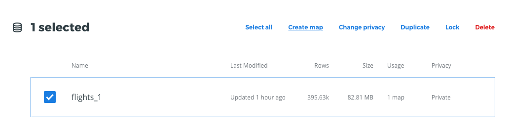

.. _casouso:

Espías en el cielo: Analizando con CARTO datos de vuelos almacenados en BigQuery
================================================================================

Un periódico quiere realizar una investigación sobre vuelos de vigilancia realizados en Estados Unidos, concretamente en la costa oeste, por parte del FBI.

Para ello, tiene a su disposición una suscripción a FlightRadar24 [#f1]_. FlightRadar24 es un servicio que permite a miles de colaboradores, subir datos de vuelos en tiempo real, utilizando el Sistema de Vigilancia Dependiente Automática (ADS-B), un sistema obligatorio para aviones que vuelan el espacio aéreo de Estados Unidos.

El sistema ADS-B, emite periódicamente la posición de un avión, obtenida a través de la navegación por satélite. Junto a la posición (longitud, latitud) se adjuntan algunos metadatos como son:

- `flight_id`: ID del vuelo en cuestión, que permite cruzarlo con datos provenientes de aerolíneas comerciales, por ejemplo.
- `timestamp`: `epoch` en el que se emitió la posición.
- `altitude`: Altitud en metros
- `speed`: Velocidad en millas por hora.

El tamaño de la información recogida por FlightRadar24 es del orden de `petabytes` y está en contínuo aumento. Actualmente, ofrece un servicio de suscripción a través de Google BigQuery, de manera que terceras partes pueden acceder a la información tanto en tiempo real como histórica a través de una cuenta de Google.

El objetivo del periódico, es poner a disposición del público general de una investigación, que incluya una herramienta visual (en este caso un mapa) que permita demostrar que estos vuelos de vigilancia se están produciendo y un breve perfil demográfico de la población afectada.

El mapa estará siempre actualizado con datos de las últimas 24 horas y será interactivo, siendo posible efectuar filtros sobre determinadas áreas geográficas.

Para el desarrollo de este trabajo, vamos a utilizar lo mejor de dos mundos. Por una parte, las capacidades de almacenamiento masivo de Google BigQuery que nos permite acceder a datos históricos de vuelos y por otra parte CARTO como plataforma de análisis geoespacial, para realizar un análisis sobre los datos que nos permita verificar las hipótesis del periódico.

A continuación, se describen los pasos seguidos.

Ingestión de datos
------------------

Sincronizar CARTO con la fuente de datos de FlightRadar24 en BigQuery (últimas 24 horas)

Accedemos a nuestro dashboard de CARTO y hacemos clic en `New dataset`

Nos aparece una interfaz con todas las fuentes de datos disponibles para conectar

Seleccionamos el conector de BigQuery

Hacemos clic en `CONNECT`

.. image:: ../_static/bq02.png
  :width: 800

Se nos muestra un diálogo para seleccionar nuestra cuenta de Google

Autorizamos a CARTO a conectar con BigQuery

Escribimos una SQL para extraer datos desde BigQuery. En este caso queremos los datos de las últimas 24 horas

::

	SELECT *
	FROM `flighradar24.flights.flights_1`
	WHERE TIMESTAMP <= CURRENT_TIMESTAMP
	  AND TIMESTAMP >= CURRENT_TIMESTAMP - interval '24 hour'

Seleccionamos la opción de `Sync my data` cada día. De esta manera los datos y visualizaciones relacionadas siempre estarán automáticamente actualizados a las últimas 24 horas de información disponible en BigQuery.

Por último, hacemos clic en `SUBMIT`. En este momento, se creará una conexión desde el PostgreSQL de la cuenta de CARTO a BigQuery, se ejecutará la consulta en BigQuery y se creará un nuevo dataset en CARTO con la información de FlightRadar24, que se actualizará diariamente.

Finalmente obtenemos un dataset en nuestra cuenta con la información que necesitamos para empezar el análisis

Como se puede observar en la imagen el dataset, contiene dos columnas `latitude`, `longitude` que CARTO ha transformado automáticamente en una columna de tipo `geometry` de PostGIS, que nos permitirá hacer análisis geoespacial.

Análisis visual
---------------

Comenzamos con el análisis visual de los datos.

Desde el dashboard seleccionamos el dataset `flights_1` y hacemos clic en `Create Map`

Nos aparece un mapa en *BUILDER* con el siguiente aspecto. Cada punto representa una posición GPS de un vuelo.

Lo primero que vamos a hacer es cambiar el mapa base a *Dark Matter*. Este mapa base nos da un mayor contraste cuando queremos encontrar patrones en datasets con gran cantidad de datos.

A continuación, centramos el mapa en la costa oeste (Los Angeles) y hacemos clic sobre el título del dataset, para ajustar las propiedades de estilo.

En el mapa actual, sólo se ve una maraña de puntos, pero no somos capaces de identificar ningún patrón. Ajustamos los siguientes valores:

Claramente somos capaces de visualizar círculos, que parecen indicar que ha habido vuelos de vigilancia, en determinadas zonas.

Podemos hacer un análisis preliminar de los datos, incluyendo un par de widgets al mapa, para filtrar por Altitud y Velocidad. Si la hipótesis de los vuelos de vigilancia es cierta, los patrones circulares deberán corresponder a posiciones de aviones que han volado a baja altura y baja velocidad, en comparación con un vuelo regular.

Hacemos clic en la pestaña `DATA` y hacemos clic en `Add as a widget` sobre las propiedades `altitude` y `speed` del dataset.

A continución, podemos aplicar un filtro sobre los widgets, para comprobar de manera visual que los círculos tienen bajos valores para ambas propiedades.

Así, seleccionando velocidades menores de 200 millas por hora, observamos que prácticamente sólo estamos filtrando los círculos.

Y lo mismo ocurre para valores de altitud por debajo de los 10.000 pies.

.. image:: ../_static/map10.png
  :width: 800

Por último, podemos convertir las secuencias de puntos de cada vuelo en líneas, para obtener una visualización más clara de lo que ha estado ocurriendo.

Hacemos clic en `ANALYSIS` > `Connect with lines` e introducimos los siguientes valores. A continuación, aplicamos las siguientes propiedades de estilo.

Y filtrando por un vuelo en concreto, comprobamos que efectivamente, hay vuelos de vigilancia sobre determinadas áreas.

Análisis geoespacial
--------------------

Sigamos con un análisis más en profundidad de los datos geoespaciales. Nuestro objetivo es definir cuáles son las áreas sujetas a vigilancia y obtener un perfil demográfico de las mismas.

Para ello, nos vamos a centrar en el vuelo `803D75D` que hemos filtrado en el apartado anterior.

En primer lugar, definimos un análisis geoespacial que nos permite :ref:`findloops` y lo aplicamos sobre nuestro dataset `flights_1` con los siguientes parámetros:

Aplicando este estilo a la capa de polígonos resultante obtenemos esta visualización, en la que se ve la área de influencia del vuelo de vigilancia.

Si añadimos una capa adicional, que nos calcule los centroides de los polígonos obtenidos en el paso anterior:

Aplicando el siguiente estilo:

Podemos hacernos una idea de cuál o cuáles eran los objetivos de vigilancia.

Cabe destacar que estos análisis se aplican de forma dinámica al dataset `flights_1` por tanto cada vez que se actualicen los datos diarios, a través de la sincronización que configuramos en el conector de BigQuery, los análisis se actualizarán también, proporcionando una vista actualizada de las áreas de influencia de los vuelos de vigilancia.

Enriquecimiento de datos
------------------------

Como último paso previo a la publicación de los resultados, vamos a obtener el perfil demográfico de las áreas de influencia. En este caso, a modo de ejemplo, vamos a obtener la población total afectada, aunque podríamos aumentar los datos utilizando información de mayor interés como, el perfil económico de los habitantes de la zona, sus hábitos de movilidad o puntos de interés turístico, gubernamentales o militares en las zonas de influencia.

Aplicamos un análisis de `Enrich from Data Observatory` con los siguientes datos.

Y añadimos un widget de tipo `Formula` sobre la nueva columna obtenida, para mostrar el número total de personas afectadas por los vuelos de vigilancia.

El número medio de personas afectadas por este vuelo en concreto es de 30.000 personas

Publicación e integración de los resultados en el periódico
-----------------------------------------------------------

Es el momento de publicar los resultados obtenidos.

En primer lugar, activamos la leyenda sobre el mapa

A continuación, añadimos la posibilidad de filtrar sobre otros atributos del dataset original.

Por último, publicamos el mapa, obteniendo un enlace para publicarlo en el periódico digital.

El resultado final se puede consultar desde el siguiente enlace [#f2]_

.. [#f1] https://www.flightradar24.com/60,15/6 - mayo 2019
.. [#f2] https://team.carto.com/u/aromeu/builder/3b38a8c6-8dff-48a2-8360-6a8ac32f43d6/embed - mayo 2019